# Scratch 精简全部指南

# 写给夏尔堕又在做独立游戏的梦了的Scratch教程

徒儿！我刚刚在网上看了一些 Scratch 的教程，发现大多是面向小朋友的，讲解贼慢，不太适合你。
所以我打算亲自写一份快速入门的教程，让你能够更高效地掌握 Scratch！这个教程是快速讲完Scratch所有的东西。不包含实践内容！

---

# 目录

TODO

## 用户界面介绍

打开<https://turbowarp.org/editor> 或者 ccw的 Gandi 

打开后你会看到主要由以下几个部分组成：

* ### 舞台

    游戏运行和展示的区域，玩家也只能看到这里的内容。舞台可以理解为一个坐标系，中心点是 (0, 0)，默认大小为 480 × 360。

* ### 编辑区

    用来拖拽、拼接积木块编写程序的地方。

* ### 角色列表

    这里会显示当前项目中的所有角色。每个角色都是独立的实体。

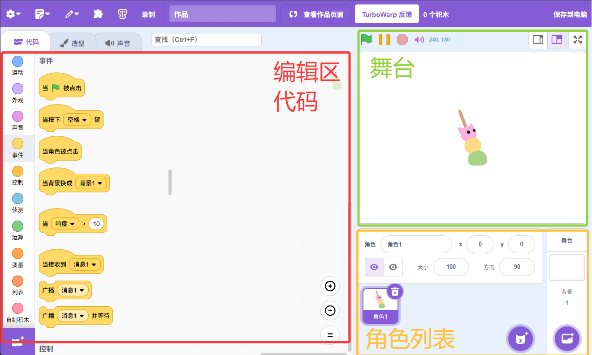

## 角色的资源

每个角色都有专属于自己的三类资源：

 * 代码

 * 造型

 * 音效

当你在角色列表中选择某个角色时，可以通过上方的标签页切换编辑对应的资源。
在代码里边你可以调用或操作这些资源，例如切换造型来实现动画效果，或播放音效来增强表现力。

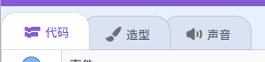

这里展示的是角色的属性。
除了上面的资源，每个角色都会拥有一系列属性。这些属性是角色的“身份信息”和“当前状态”，程序代码可以对它们进行读取或修改，从而控制角色的表现：

* x 坐标 / y 坐标： 角色在舞台上的位置。
* 方向： 角色朝向的角度（0°朝上，90°朝右）。
* 大小： 角色的尺寸百分比。
* 显示/隐藏： 角色是否可见。
* ...

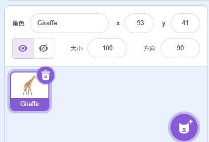

ok用户界面介绍完了

# 积木

Scratch 的代码是由积木组成的。这些积木可以分为三种主要类型，看它们的样子你也能猜出个大概喵

* ## 命令积木（黄色框里的积木）

    执行一个动作或行为。它们不直接返回任何值，只是让程序“做”一件事。
    
    游戏含义： 比如让角色 移动[10]步，说[你好！]，隐藏 角色，或者 播放声音[喵]。它们是游戏中的“动词”。
    
* ## 布尔值积木（蓝色框里的积木）

    进行判断或逻辑比较，只返回两种结果：真 (True) 或 假 (False)。

    游戏含义： 比如 碰到[鼠标指针]?（是或否），[5] < [8]?（真），[血量] = [0]?（真或假）。它们是游戏中做出“是”或“否”决定的基础，常用于条件判断和循环。

* ## 普通的值积木（绿色框里面的积木）

    返回一个数据值（可以是数字、文本或其他信息）。

    游戏含义： 比如计算 [1] + [2] 返回 3，获取当前角色的 x 坐标，获取 计时器 的值，或者 随机取数在[1]到[10]之间。它们是游戏中的“名词”或“量词”，提供具体的数据。

组合起来使用的列子：

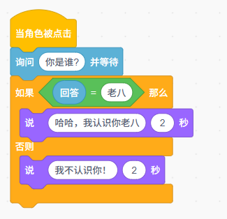

> 提示：你可以点击积木来测试运行，看看他会返回什么，比如点击 (1 + 2) 积木会显示 3 这是一个非常实用的调试技巧！

# 程序的开始

在 Scratch 中，所有的程序都由一个特殊的积木——帽子积木（也称为“事件积木”或“起始积木”）开始。它们是触发代码执行的“事件监听器”。

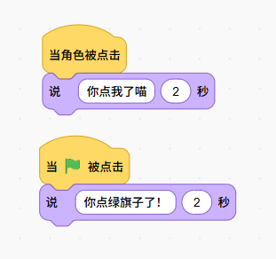

试试这个，当你点击这个角色的时候就会触发这个事件（注：可以有多个同样的事件，比如多个`当🚩被点击`）

# 事件驱动：让角色彼此沟通

除了直接的用户输入或游戏状态变化，角色之间也可以通过广播消息来相互沟通和协调行为（也可以使用变量列表来沟通，在下文会讲）。

这是构建复杂游戏逻辑的强大工具：

广播[消息1]： 一个角色可以“广播”一个消息（就像发出一个信号）。这个积木是一个命令积木。

当接收到[消息1]： 其他角色（甚至广播者自己）可以“监听”并响应这个消息。这是一个帽子积木。

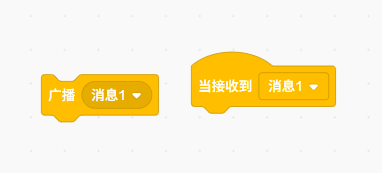

# 流程控制与自定义积木

在游戏开发中，我们经常需要根据不同情况做不同的事，或者重复做某件事，以及在很多地方重复使用一段代码
使用`控制`分类里面的积木和`自定义积木`就能很好的解决这个问题！

### 条件判断

条件判断就是让程序学会“看情况办事”。当满足某个条件时，执行一段代码；否则，执行另一段代码，或者什么也不做

比如
`如果血量小于 0，那么就死亡`
`如果拥有弹跳鞋子那么跳跃10高度否则跳跃3高度`

Scratch 里面有 `如果<>那么...`, `如果<>那么...否则...`

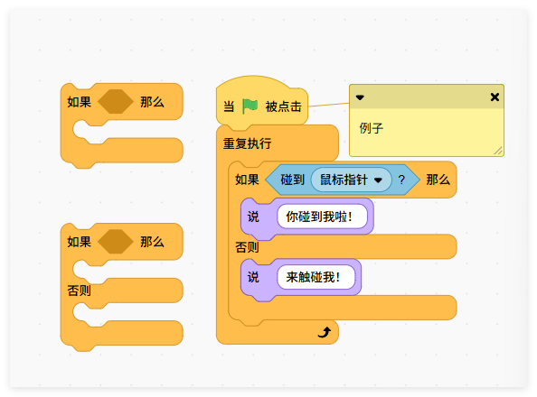

### 循环

循环就是**重复做同一件事**，直到**满足某个条件**才结束。比如。它是游戏更新、动画、敌人生成等不可或缺的部分。
`游戏里无限生成怪物，直到玩家死掉或者通关`
`一直重复检测玩家是否按下移动按键`

Scratch 里面有 `重复10次...`, `重复...直到<>`, `等待<>`

为什么等待也被列入循环了？其实等待就是一种循环，只不过他没有任何内容。

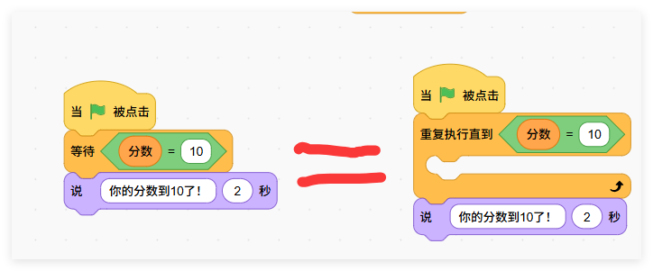

### 条件 + 循环结合

在实际游戏开发中，条件判断和循环往往会一起使用，构成游戏的核心逻辑。例如，游戏的主循环通常是一个 永远重复 积木，里面包含了一系列的 如果...那么... 积木来响应各种情况。
**最常见的例子**： 持续判断玩家是否按下了方向键，如果按下了就移动角色：

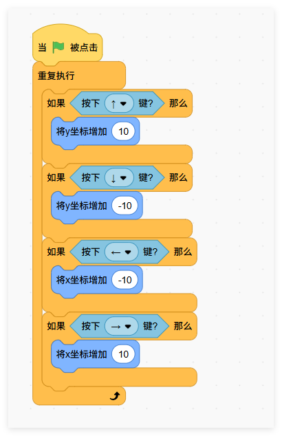

这里，永远重复 保证了游戏在持续地检查玩家的输入

### 自定义积木

Scratch 提供了多种多样的积木，但有时你发现需要重复写一段相似的代码，或者一段逻辑很长，看起来很乱，这时，自定义积木就派上用场了！自定义积木可以让你创建你自己的积木使用Scratch 提供的积木。你就能自己创建和使用自己封装的积木了

在这里可以创建和使用你已经创建的积木

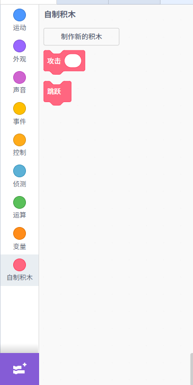

创建自己的积木的时候也可以设置这个积木的输入：

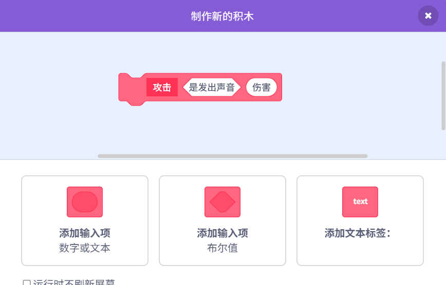

它可以减少重复，就不用一遍遍堆相同的积木！只需要一块自定义积木！

也可以让代码更加整洁和模块化！别人一看积木名字就知道它干嘛。

### 数据类型

在编程里，数据类型就是不同种类的数据。
Scratch 目前支持三种基本的数据类型：布尔类型、数字类型、文字类型。

* ## 布尔类型

    布尔类型只有两个取值：True（真） 和 False（假）。
    常常用在条件判断里，帮助程序做选择和决策。它的积木形状是**六边形**。

    举个例子：

    “今天下雨了吗？” → 可能是 True（是） 或者 False（不是）。

    在游戏里，“角色是否死亡？” 也是布尔类型。

    Scratch 里常见的布尔运算有：
    
    并且 / 或者 / 不（逻辑运算）

* ## 数字类型
    数字类型就是各种数值，可以用来做数学运算。它的积木形状是圆角矩形，输入框也是**圆角矩形**。
    比如：

    角色的 坐标 (x, y)

    玩家分数

    角色的生命值

    你可以对数字做：

    加减乘除（+ - * /）

    比较大小（> < =）

    取余数、开方、四舍五入等

* ## 文字类型（字符串类型）
    文字类型，也叫 字符串类型。它的积木形状是圆角矩形，输入框也是**圆角矩形**。
    它表示一串文字，可以是：

    玩家输入的名字

    聊天消息

    游戏提示语

    文字可以和文字拼接在一起，比如：
    "你好，" + 玩家名字 → 得到 "你好，小明"

    在 Scratch 里，还能把文字和数字混在一起使用，比如：
    "分数：" + 分数 → 得到 "分数：100"

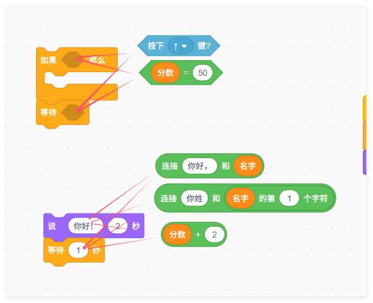

对应的数据类型放到对应的积木输入里面

# 数据结构：变量和列表

有时候想记录一些数据，比如玩家的分数，或者是游戏的地方数据。Scratch有两种存储数据的方法：`变量`和`列表`

* 变量：可以看作一个命名的存储格，里面只能保存一条数据（数字或文本）。你可以随时修改它的值或读取它的内容。常见用途：玩家分数、角色血量、当前关卡号等。

* 列表：可以看作一组按顺序排列的存储格（类似数组），每个格子都有编号（从 1 开始）。它能同时保存多条数据，并支持动态增加或删除项。常见用途：排行榜上的所有分数、背包物品清单、地图格子数据等。

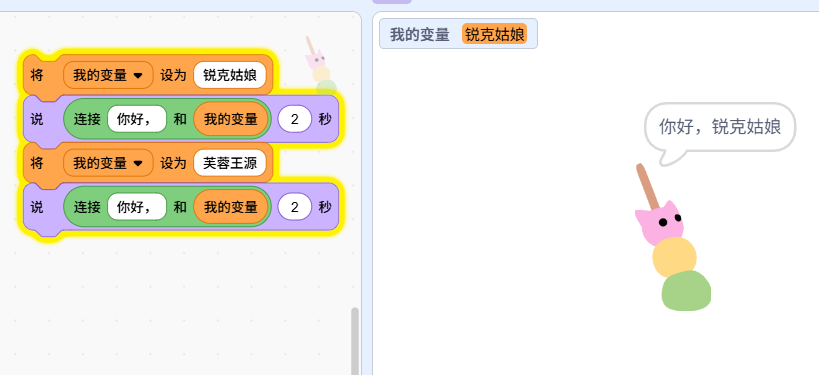
 

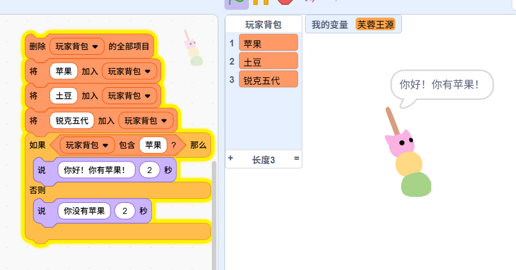

# 克隆体

假设你在做一个射击游戏，玩家能发射许多子弹。每次发射子弹都新建一个子弹角色？那太麻烦了！子弹、敌人大军，这些都需要大量的**重复**对象。克隆体能制造大量的重复对象，但每个重复对象又能拥有独立的数据状态（比如某个敌人的血量，某个子弹的坐标）

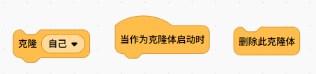

克隆体只有这三个积木：
* ## 创建[我的克隆]克隆体: 
    生成当前角色的一个副本。这个副本（克隆体）会继承原角色（原型）的所有代码和资源（造型、音效、当前属性值）。

    游戏含义： 当玩家开火时，原型子弹角色执行 创建[我的克隆]克隆体，就生成了一颗独立的子弹。

* ## 当作为克隆体启动:
    这是一个特殊的帽子积木。只有当一个克隆体被创建并启动时，它下面的代码才会触发执行。原型角色不会执行这里的代码。

    游戏含义： 克隆出来的子弹会在这里设置自己的初始速度、方向，并开始移动；克隆出来的敌人会在这里开始自己的寻路或攻击逻辑。
* ## 销毁此克隆体: 
    移除执行这个代码的克隆体。一旦销毁，这个克隆体就会从舞台上消失，并释放其占用的内存。
    
    游戏含义： 子弹飞出屏幕后，或者敌人被玩家击败后，都需要执行 销毁此克隆体，以避免游戏卡顿和资源浪费。

# 私有变量

这里有个超级重要的点：每个克隆体在被创建时，会继承原角色所有变量的当前值，并且从那一刻起，它们各自拥有一份独立的变量副本

这意味着，如果一个变量叫 我的生命值，原角色是100，克隆体被创建时也是100。
但之后，其中一个克隆体被打掉50血，它的 我的生命值 变成50，这不会影响原角色或其他克隆体的 我的生命值。它们是各自**独立**的！
反之： 如果你想要所有克隆体共享一个全局信息（比如游戏的总分数），那就用“为所有角色”的全局变量。

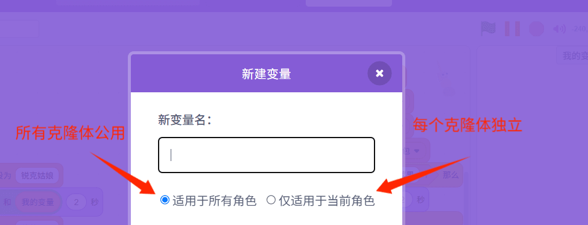
